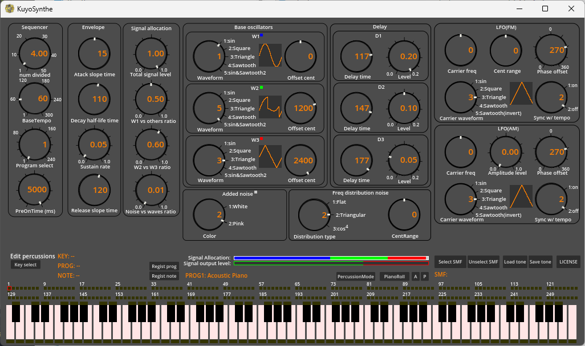

# KuyoSynthe

KuyoSynthe is toy synthesizer for Godot using GDSYNTHESIZER.

 

## What is KuyoSynthe?

KuyoSynthe is an example implementation of GDSYNTHESIZER using Godot script.
KuyoSynthe is included in the GDSYNTHESIZER repository as an example application.

KuyoSynthe is:
 - an example implementation of GDSYNTHESIZER using Godot script
 - a way to learn how to use GDSYNTHESIZER
 - tone editor for each musical instruments of midi
 - sequence player for SMF files

KuyoSynthe has been confirmed to work as a desktop app on Windows.
Also, KuyoSynthe has been confirmed to work as a WEB (HTML) application for Windows PCs.
Operation on other platforms has not been confirmed.
Target Godot Version is ver.4.2.1.

This project is just a hobby of the author and may not necessarily work the way you want it to.

## How to install

KuyoSynthe is included in the GDSYNTHESIZER repository at `examples/kuyosynthe/`.

Since GDSYNTHESIZER is integrated in this repository, you need to build GDSYNTHESIZER first.
See the main [README.md](../../README.md) for build instructions.

After building GDSYNTHESIZER, the runtime library files will be generated in `project/bin/`.
Copy these files to `examples/kuyosynthe/godot_project/bin/`:

```
examples/kuyosynthe/godot_project/bin/
    gdsynthesizer.gdextension
    libgdsynthesizer.windows.template_debug.x86_64.dll
    libgdsynthesizer.windows.template_release.x86_64.dll
    libgdsynthesizer.web.template_release.wasm32.wasm
    libgdsynthesizer.web.template_debug.wasm32.wasm
```

Then open `examples/kuyosynthe/godot_project/` in Godot Engine and run the project.

## How to use

Each parameter can be changed using the dial knob. Change the dial knob by hovering over the mouse cursor and using the wheel.
Put your favorite SMF file in the `godot_project/` directory. Then press the "select SMF" button to select the file and play it.


